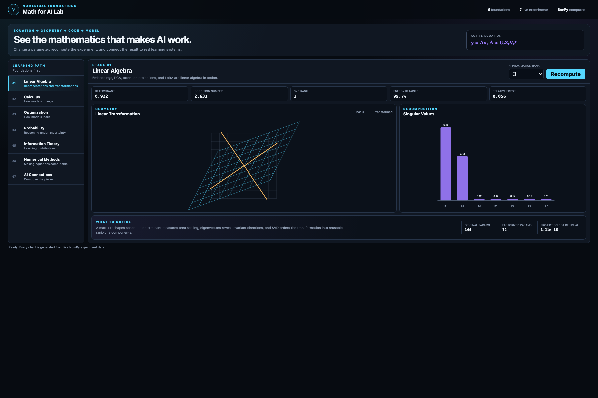

# Math for AI Lab

A standalone NumPy project for learning the mathematics behind artificial
intelligence through equations, numerical experiments, and interactive
visualization.



The project is not a formula encyclopedia. Every topic follows the same chain:

```text
concept -> equation -> NumPy computation -> visualization -> AI application
```

## What Is Implemented

- **Linear algebra:** vector projection, linear transformations, eigenvectors,
  singular values, low-rank approximation, parameter counts
- **Calculus:** analytic derivatives, finite differences, tangents, chain-rule
  backpropagation, gradient checking
- **Optimization:** ill-conditioned loss surfaces, gradient descent, momentum,
  Adam, convergence traces
- **Probability:** Gaussian density, sampling, expectation, variance, Bayesian
  updating
- **Information theory:** entropy, cross-entropy, KL divergence, softmax
  temperature
- **Numerical methods:** conditioning, perturbation amplification, overflow,
  stable softmax
- **AI connections:** linear regression training and scaled dot-product
  attention

## Start the Lab

```bash
cd MathForAI
python -m venv .venv
source .venv/bin/activate
python -m pip install -r requirements.txt
python -m visualizer.server
```

Open:

```text
http://127.0.0.1:8771
```

The browser sends experiment parameters to the Python API. NumPy recomputes the
result, and the page renders the returned geometry and metrics.

## Project Structure

```text
MathForAI/
├── math_for_ai/
│   ├── linear_algebra.py
│   ├── calculus.py
│   ├── optimization.py
│   ├── probability.py
│   ├── information.py
│   ├── numerics.py
│   ├── connections.py
│   ├── curriculum.py
│   └── experiments.py
├── visualizer/
│   ├── server.py
│   └── static/
├── tests/
└── docs/
    └── STUDY_GUIDE.md
```

## Recommended Learning Order

1. Treat vectors as coordinates and matrices as transformations.
2. Use eigenvectors and SVD to understand representation and compression.
3. Interpret derivatives as sensitivity, then compose them with the chain rule.
4. Compare optimizers on the same loss surface.
5. Treat predictions as probability distributions rather than isolated numbers.
6. Connect cross-entropy and KL divergence to model training.
7. Study numerical stability before increasing model scale or precision demands.
8. Rebuild regression and attention from the preceding mathematical pieces.

## Relationship to the Other Projects

- `ANN` implements neural-network modules and explicit backpropagation.
- `FineTuning` applies low-rank adaptation and modern training workflows.
- `Quantum` uses linear algebra for state vectors, operators, and tensor
  networks.
- `MathForAI` isolates the mathematical ideas shared by all three.

## Tests

```bash
python -m pytest -q
```

The tests cover mathematical invariants, not just code execution:

- Projection residuals are orthogonal.
- Full-rank SVD reconstructs its input.
- Finite differences match analytic derivatives.
- Chain-rule gradients match numerical gradients.
- Adam reduces an ill-conditioned quadratic loss.
- Gaussian density integrates to one.
- KL divergence is non-negative.
- Stable softmax handles large logits.

## Further Reading

- [Deep Learning, Chapter 2: Linear Algebra](https://www.deeplearningbook.org/contents/linear_algebra.html)
- [Stanford CS229 Linear Algebra Review](https://cs229.stanford.edu/section/cs229-linalg.pdf)
- [Google Machine Learning Crash Course: Gradient Descent](https://developers.google.com/machine-learning/crash-course/linear-regression/gradient-descent)

## Scope

This is a compact research and learning environment, not a substitute for a
complete mathematics degree or a production machine-learning framework. The
examples are deliberately low-dimensional so that the computations remain
inspectable.
